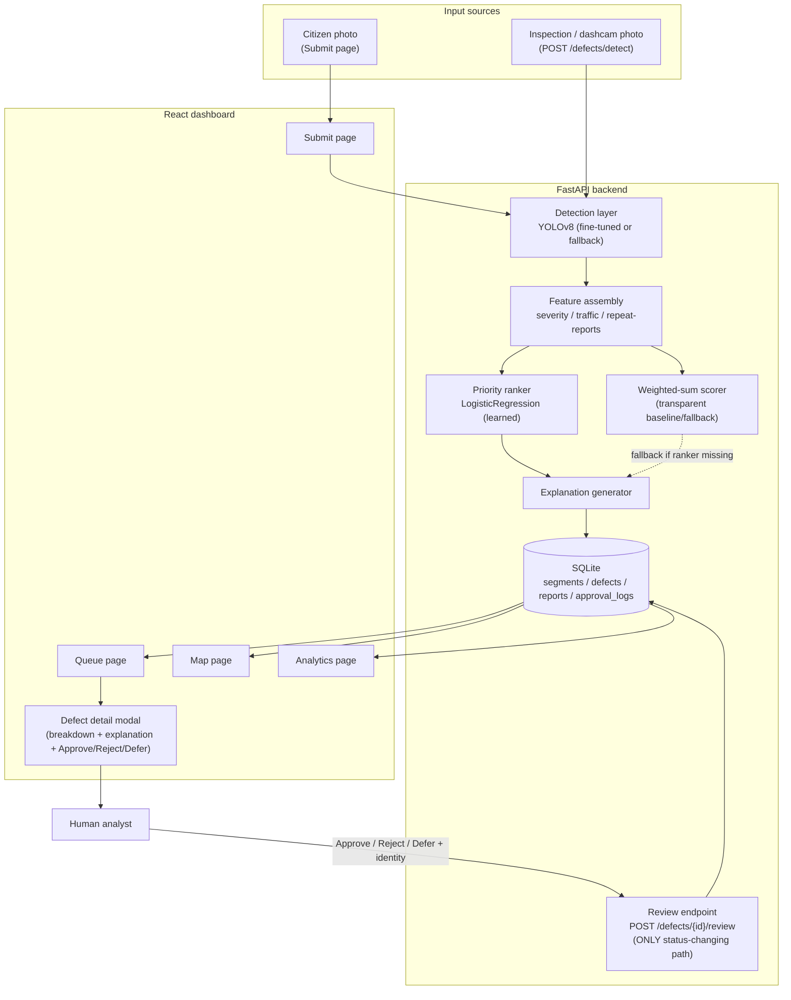

# Architecture

## Component diagram

## Data flow, step by step

1. **Image in.** A citizen (Submit page → `POST /reports`) or an
   inspector/dashcam operator (`POST /defects/detect`) uploads a photo of a
   road segment.
2. **Detection.** `app/detection/detector.py` runs YOLOv8 inference,
   returning bounding boxes, class, confidence, and bbox area as % of frame
   for each defect found.
3. **Feature assembly.** `app/scoring/features.py` combines detection
   output with the road segment's synthetic traffic volume and the
   time-decayed count of repeat reports at that location into a 3-value
   feature vector, each normalized to `[0,1]`.
4. **Scoring.** `app/scoring/ranker_model.py` (a trained
   `LogisticRegression`) turns the feature vector into a priority score
   `[0,1]` plus a per-factor percentage breakdown read directly off the
   model's coefficients. `app/scoring/weighted_model.py` is a fully
   transparent hand-weighted alternative, used as a fallback if the ranker
   model file is missing.
5. **Explanation.** `app/scoring/explain.py` turns the score + features
   into the human-readable sentence shown in the dashboard - every ranked
   item gets one, unconditionally.
6. **Persistence.** Everything lands in SQLite via SQLAlchemy
   (`road_segments`, `defects`, `reports`, `approval_logs`).
7. **Ranked queue out.** `GET /queue` re-scores all open defects and
   returns them sorted by priority, each with its full breakdown and
   explanation attached - nothing is pre-computed/cached in a way that
   could go stale relative to new repeat reports.
8. **Human review.** The dashboard's Queue/Map pages let an analyst open
   any defect, see the photo with its detection box overlaid, the score
   breakdown, and the explanation, then Approve / Reject / Defer. This
   calls `POST /defects/{id}/review`, the **only** code path in the entire
   system that can change a defect's status - it requires a
   `reviewer_name` and writes an immutable, timestamped `ApprovalLog` row.
   No code path can mark something "scheduled" without going through here.

## Why this satisfies the human-oversight constraint structurally

The constraint isn't just documented in prose - it's enforced by the data
model: `Defect.status` has no setter anywhere except inside
`routers/reviews.py:review_defect()`, which validates both `action` and a
non-empty `reviewer_name` before writing. Every other endpoint
(`/defects/detect`, `/reports`, `/queue`) only ever creates `open` defects
or reads existing ones.

## Backend module map

| Module | Responsibility |
|---|---|
| `app/detection/detector.py` | YOLOv8 wrapper: load weights, run inference, map classes |
| `app/detection/train.py` | Fine-tuning script (tiny hand-labeled set) |
| `app/scoring/traffic_sim.py` | Synthetic traffic generator (documented) |
| `app/scoring/repeat_reports.py` | Time-decayed repeat-report clustering |
| `app/scoring/features.py` | Assembles the 3-factor feature vector |
| `app/scoring/weighted_model.py` | Transparent weighted-sum scorer |
| `app/scoring/train_ranker.py` | Trains the LogisticRegression ranker - synthetic labeled set by default, or real `ApprovalLog` decisions via `--from-approvals` once enough exist |
| `app/scoring/measure_impact.py` | Computes real, measured "Measurable impact" numbers from the seeded database (see `/README.md`) |
| `app/scoring/ranker_model.py` | Loads the ranker, scores defects, computes coefficient-based breakdown |
| `app/scoring/explain.py` | Turns score + features into the analyst-facing explanation string |
| `app/routers/*.py` | FastAPI endpoints (defects, reports, queue, reviews, analytics, segments) |
| `app/services.py` | Shared ORM→API-schema scoring/serialization logic used by all routers |
| `app/seed.py` | Demo data generator (see `/data/README.md`) |

## Frontend module map

| Module | Responsibility |
|---|---|
| `pages/QueuePage.jsx` | Ranked list + filters, opens defect detail modal |
| `pages/MapPage.jsx` | Leaflet map, pins sized by priority / colored by status |
| `pages/AnalyticsPage.jsx` | Recharts: by-type, by-district, trend, review-outcomes |
| `pages/SubmitPage.jsx` | Citizen photo submission form |
| `components/DefectDetailModal.jsx` | Photo + bbox overlay, score breakdown, explanation, review actions |
| `components/ReviewActions.jsx` | Approve/Reject/Defer form (reviewer name required) |
| `api.js` | Thin axios wrapper over the FastAPI backend |
| `i18n.jsx` | ru/en lang toggle (ru default) - UI copy strings; per-value labels (defect type/status/district/factor) live in `constants.js` as `{en, ru}` pairs |
